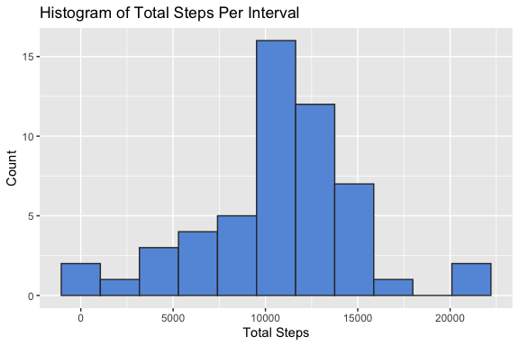
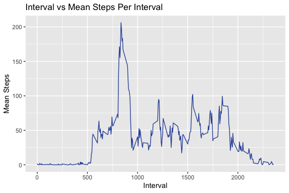
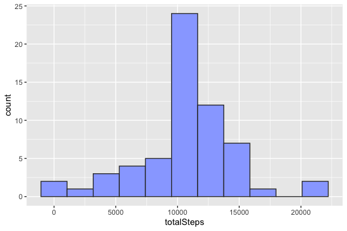
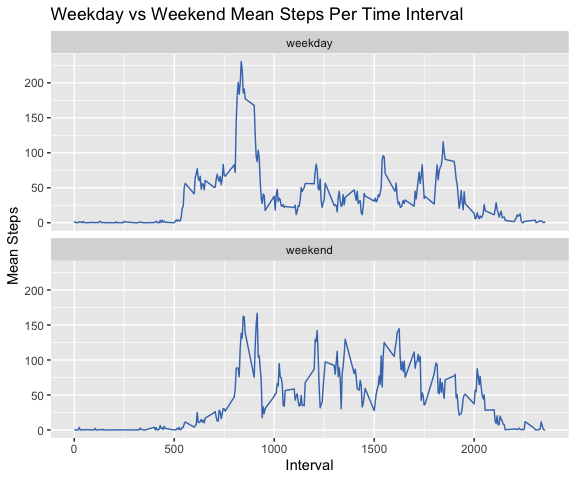

Personal Activity Monitoring Device Analysis
--------------------------------------------

The data in this analysis is taken from a device that collected data at
5 minute intervals throughout the day. The data consists of two months
of data from an anonymous individual collected during the months of
October and November, 2012 and include the number of steps taken in 5
minute intervals each day.

### Read And Prepare The Data Set

#### Read The Data

    if(file.exists("./activity.zip")){
      unzip("./activity.zip")
    }

    dataOrig <- read.csv("activity.csv")
    head(dataOrig)

      steps       date interval
    1    NA 2012-10-01        0
    2    NA 2012-10-01        5
    3    NA 2012-10-01       10
    4    NA 2012-10-01       15
    5    NA 2012-10-01       20
    6    NA 2012-10-01       25

#### Load The Necessary Packages

    library(magrittr)
    library(dplyr)
    library(ggplot2)

#### Preprocess Data By Converting Strings To Dates

    dataOrig$date <- as.Date(dataOrig$date)

     

### *What Is The Total Number Of Steps Taken Per Day?*

#### Calculate Step Sum By Day

    totalStepsSumByDay <- dataOrig %>% group_by(date) %>% summarise(totalSteps = sum(steps))
    head(totalStepsSumByDay, 4)

    # A tibble: 4 x 2
      date       totalSteps
      <date>          <int>
    1 2012-10-01         NA
    2 2012-10-02        126
    3 2012-10-03      11352
    4 2012-10-04      12116

#### Histogram Of The Total Number Of Steps Taken Each Day

    theBinWidth=(max(totalStepsSumByDay$totalSteps, na.rm=TRUE)-min(totalStepsSumByDay$totalSteps, na.rm=TRUE))/10

    ggplot(totalStepsSumByDay, aes(x=totalSteps)) + 
      geom_histogram(binwidth = theBinWidth, fill = "#6699dd", col="#333333") +
      labs(x = "Total Steps", y = "Count", title = "Histogram of Total Steps Per Interval")

#### The Mean Of The Total Number Of Steps Taken Per Day

    meanTotalSteps <- mean(totalStepsSumByDay$totalSteps, na.rm=TRUE)
    paste("mean = ", round(meanTotalSteps,2))

    [1] "mean =  10766.19"

#### The Median Of The Total Number Of Steps Taken Per Day

    medianTotalSteps <- median(totalStepsSumByDay$totalSteps, na.rm=TRUE)
    paste("median = ", medianTotalSteps)

    [1] "median =  10765"

     

### *What Is The Average Daily Activity Pattern?*

#### Time Series Graph Of Time Interval vs Mean Number Of Steps Taken Across All Days

    totalStepsMeanByInterval <- dataOrig %>% group_by(interval) %>% summarise(meanSteps = mean(steps, na.rm=TRUE))

    g <- ggplot(totalStepsMeanByInterval, aes(interval, meanSteps))

    g + geom_line(col="#3355aa") + 
      labs(x ="Interval", y="Mean Steps", title="Interval vs Mean Steps Per Interval")

#### Time Interval With The Maximum Number Of Steps

    maxIntervalIndex <- which(totalStepsMeanByInterval$meanSteps == max(totalStepsMeanByInterval$meanSteps))
    maxInterval <- totalStepsMeanByInterval$interval[maxIntervalIndex]
    paste("Max interval = " , maxInterval)

    [1] "Max interval =  835"

     

### *What Is The Total Number Of Steps Taken Per Day With Imputed Data?*

#### Number Of Rows With NAs

    numberNAs <- sum(!complete.cases(dataOrig))
    paste("Number of rows with NA = " , numberNAs)

    [1] "Number of rows with NA =  2304"

#### Replace The NAs In The Data Set With The Mean According To The Corresponding Time Interval

    dataOrig <- dataOrig %>% group_by(interval)%>%mutate(steps=ifelse(is.na(steps),mean(steps, na.rm=TRUE),steps))
    head(dataOrig)

    # A tibble: 6 x 3
    # Groups:   interval [6]
       steps date       interval
       <dbl> <date>        <int>
    1 1.72   2012-10-01        0
    2 0.340  2012-10-01        5
    3 0.132  2012-10-01       10
    4 0.151  2012-10-01       15
    5 0.0755 2012-10-01       20
    6 2.09   2012-10-01       25

#### Histogram Of The Total Number Of Steps Taken Each Day For The Imputed Data

    totalStepsSumByDayImputed <- dataOrig %>% group_by(date) %>% summarise(totalSteps = sum(steps))
    theBinWidth = (max(totalStepsSumByDayImputed$totalSteps, na.rm=TRUE) - min(totalStepsSumByDayImputed$totalSteps, na.rm=TRUE)) / 10

    ggplot(totalStepsSumByDayImputed, aes(x=totalSteps)) + 
      geom_histogram(binwidth = theBinWidth, fill = "#99aaff", col="#333333")

#### The Mean Of The Total Number Of Steps Taken Per Day For The Imputed Data

    meanTotalStepsImputed <- mean(totalStepsSumByDayImputed$totalSteps)
    paste("mean = ", round(meanTotalStepsImputed,2))

    [1] "mean =  10766.19"

#### The Median Of The Total Number Of Steps Taken Per Day For The Imputed Data

    medianTotalStepsImputed <- median(totalStepsSumByDayImputed$totalSteps)
    paste("median = ", round(medianTotalStepsImputed,2))

    [1] "median =  10766.19"

#### Comparing The Non-Imputed Data To The Imputed Data

The histogram of total steps taken each day for the non-imputed data is
similar in shape to the histogram with imputed data. However, the 6th
rectangle of the histogram of imputed data is higher and therefore
indicates a higher frequency. The means of the non-imputed and imputed
data are the same. The medians of the non-imputed and imputed data are
different.

NOTE: In the calculation of mean and median for the non-imputed data, I
used na.rm = TRUE to eliminate the variables with an NA from the
calculations.

     

### *Are There Differences In Activity Patterns Between Weekdays And Weekends?*

#### Add A Factor Variable To The Data Set For Weekend Or Weekday

    dataOrig <- dataOrig %>% mutate(dayOfWeek=ifelse(weekdays(date) %in% c("Saturday","Sunday"),"weekend","weekday"))
    dataOrig$dayOfWeek <- as.factor(dataOrig$dayOfWeek)
    head(dataOrig)

    # A tibble: 6 x 4
    # Groups:   interval [6]
       steps date       interval dayOfWeek
       <dbl> <date>        <int> <fct>    
    1 1.72   2012-10-01        0 weekday  
    2 0.340  2012-10-01        5 weekday  
    3 0.132  2012-10-01       10 weekday  
    4 0.151  2012-10-01       15 weekday  
    5 0.0755 2012-10-01       20 weekday  
    6 2.09   2012-10-01       25 weekday  

#### Panel Plot - Time Series Graphs Of Time Interval vs Mean Number Of Steps By Weekend vs Weekday

    totalStepsMeanByIntervalAndDayOfWeek <- 
      dataOrig %>% group_by(dayOfWeek,interval) %>% summarise(meanSteps = mean(steps, na.rm=TRUE))

    g <- ggplot(totalStepsMeanByIntervalAndDayOfWeek, aes(interval, meanSteps))
    g + geom_line(col="#4477bb") + facet_wrap( ~ dayOfWeek, nrow=2, ncol=1 ) + 
      labs(x ="Interval", y="Mean Steps", title="Weekday vs Weekend Mean Steps Per Time Interval")

